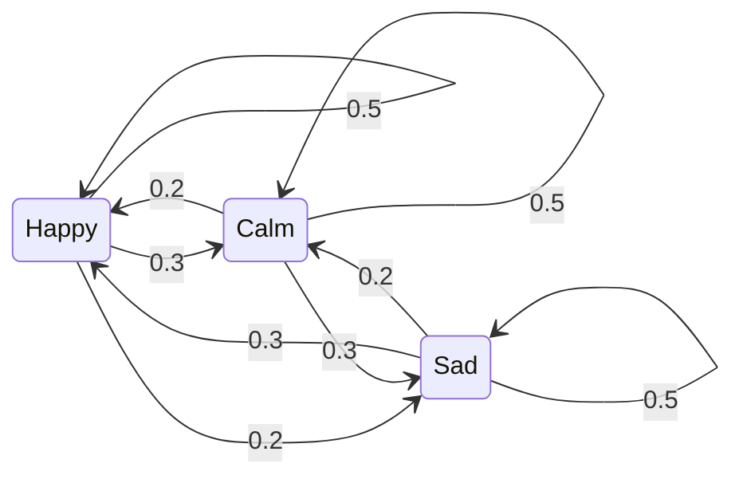

# Life as Mean Reversion: Modeling Personality and Relationships with Markov Chains

## Contents

#### [How It Began](#how-it-began)
#### [Building the Model](#building-the-model)
#### [The Answer Over Time](#the-answer-over-time)
#### [Limitations](#limitations)
#### [What It Teaches Us](#what-it-teaches-us)
#### [What Should We Do?](#what-should-we-do)
#### [A Final Word](#a-final-word)

## How It Began

> Misfortune is what fortune leans upon; fortune is where misfortune lies in wait. — *Tao Te Ching*

As a fairly sensitive person, dealing with others has always been something that cost me no small amount of mental effort. I often overreact to how other people behave, and I often either over-express myself or shut myself off entirely because of my own state of mind.

At every moment, we occupy some emotional state or other — and sometimes the feeling can't even be put into words. In our interactions we play different roles, and each role tends to call for an ideal emotional state. At home, for instance, a father might be expected to be calm and kind.

At the same time, in these interactions we also expect the other person to be in the ideal emotional state we have in mind for them. To stay with the family example: when a father faces his son, he often hopes to see the son cheerful and happy.

So analyzing a person's state seems like a decent entry point for making sense of relationships.

## Building the Model

Let's start with an idealization. Rather than trying to account for the full, delicate complexity of a person's emotions, we'll assume that a person has only three states: happy, calm, and sad.

On any given day, each person can be in one of these three states. On a particular day, for example, someone might have:

- an $a\%$ chance of being happy;
- a $b\%$ chance of being calm;
- a $c\%$ chance of being sad;

satisfying

$$
a + b + c = 100
$$

At the same time, each person holds a single state constant throughout the day; the state only changes once the day is over.

The diagram above describes the following:

- If yesterday was happy, then today there is a 0.5 chance of being happy, a 0.3 chance of being calm, and a 0.2 chance of being sad.
- If yesterday was calm, then today there is a 0.2 chance of being happy, a 0.5 chance of being calm, and a 0.3 chance of being sad.
- If yesterday was sad, then today there is a 0.3 chance of being happy, a 0.2 chance of being calm, and a 0.5 chance of being sad.

Laid out as a table, it looks like this:

| State | Next-day Happy | Next-day Calm | Next-day Sad |
|---|---:|---:|---:|
| Previous-day Happy | 0.5 | 0.3 | 0.2 |
| Previous-day Calm | 0.2 | 0.5 | 0.3 |
| Previous-day Sad | 0.3 | 0.2 | 0.5 |

To give it a bit more of a mathematical flavor, we can write it as a matrix:

$$
P =
\begin{pmatrix}
0.5 & 0.3 & 0.2 \\
0.2 & 0.5 & 0.3 \\
0.3 & 0.2 & 0.5
\end{pmatrix}
$$

Let's give this matrix a suitably mathematical name and call it the transition matrix.

In this idealized model, I would rather spend time with people who are in a happy state, because they tend to bring a more positive, uplifting emotional influence. By contrast, I am less inclined to seek out people who are in a sad state, because I instinctively want to avoid or screen off emotions that might make me feel worse.

Symmetrically, in this model, someone who interacts with me also hopes to see my happy state and to avoid my sad one.

## The Answer Over Time

Suppose that on day one a person has an initial state: $100\%$ happy, $0\%$ calm, $0\%$ sad.

Expressed mathematically, we can write this as:

$$
\alpha_0 = (1, 0, 0)
$$

Then, one day later, they will have:

- a $1 \times 50\%$ chance of being happy;
- a $1 \times 30\%$ chance of being calm;
- a $1 \times 20\%$ chance of being sad;

In mathematical language:

$$
\alpha_1 = \alpha_0 P = (0.5, 0.3, 0.2)
$$

Two days later, they will have:

$$
\alpha_2 = \alpha_1 P = (0.37, 0.34, 0.29)
$$

That is:

- a $37\%$ chance of being happy;
- a $34\%$ chance of being calm;
- a $29\%$ chance of being sad;

So what happens over a long stretch of time — after countless days?

You don't need any mathematical background here; I'll just tell you the answer. As time approaches infinity, their state becomes:

$$
\lim_{n \to \infty} \left( \alpha_0 P^n \right)
\ =
\left(
\frac{1}{3},
\frac{1}{3},
\frac{1}{3}
\right)
$$

And what if I change the starting state? If $\alpha_0 = (0.3, 0.4, 0.3)$, would the answer still be the same?

The answer is yes, it's the same. In fact, as time approaches infinity, the person's state reaches a kind of equilibrium, and we can simply write down the equation:

$$
\pi P = \pi
$$

Solving it gives:

$$
\pi =
\left(
\frac{1}{3},
\frac{1}{3},
\frac{1}{3}
\right)
$$

Intuitively, this means that as time approaches infinity, no matter what the person's initial state (happy / calm / sad) happened to be, they will end up with:

- a $33.33\%$ chance of being happy;
- a $33.33\%$ chance of being calm;
- a $33.33\%$ chance of being sad;

One subtlety is worth flagging here. The long-run answer comes out to a clean, uniform $1/3$ across the board *only* because the matrix I happened to choose has columns that each sum to $1$ as well — what's called a **doubly stochastic** matrix. Pick a different matrix and the long-run answer would settle on some other set of proportions. What holds in general is the deeper point: the state converges to a single distribution that doesn't depend on where you started.

If you've made it this far, you've already grasped the core idea of the **Markov chain**. There's no rigorous proof here, and no careful treatment of subtleties like oscillating or transient states — but that was never the goal. All I'm really after is an intuitive grasp of the idea.

## Limitations

Of course, as I said at the outset, all of the analysis above rests on a relatively idealized scenario. In real human interaction, a person's states can never be reduced to just three; they are usually rich and complex, and some of them are hard to capture accurately in words. For that very reason, to portray this process of change more faithfully, we would need to lay the states out as much longer vectors, and to expand the transition matrix into far higher dimensions.

At the same time, describing the transition process in units of "days" is still, at heart, a discrete analysis. But a person's emotions can shift anytime and anywhere, so we could go a step further and analyze this change in a continuous way.

What's more, the process of state transition is itself not set in stone. In the idealized model above we can describe it with a fixed transition matrix $P$, but in reality this matrix may itself change with context, time, or the external environment.

Still, either way, we now have a decent foundation to work from.

## What It Teaches Us

What we call personality is really a description of how a person reacts differently to the same event. When we speak of a gentle-tempered teacher versus a hot-tempered one, what we usually mean is that, faced with a mischievous student, the former might patiently guide them along, while the latter might sternly scold them.

Taking this a step further, the transition matrix $P$ mentioned above is precisely a description of reaction — or, put another way, a description of personality.

Although I just said that the transition matrix $P$ changes anytime and anywhere, its fluctuations tend to stay within a certain range — and the shorter the time span, the narrower that range usually is.

Intuitively: over a short time, your personality barely changes; only over a long time does it really shift.

For instance, your reaction to the words "Zhenhai High School" ten minutes ago versus ten minutes from now is unlikely to differ much; but the you of ten years ago and the you of ten years from now might react to those same words with a difference you can't even imagine.

So here we arrive at a rather interesting finding: as long as your personality stays the same, then no matter how you behave at the start, over time your behavior is bound to converge toward a stable state — and what that state actually looks like is determined by your personality.

Tying this back to the earlier material, the rational way to put it is this: no matter how $\alpha_0$ varies, as long as $P$ stays constant, then as $n$ approaches infinity, $\alpha_n$ will converge toward $\pi$.

Perhaps life is one long exercise in mean reversion, and what ultimately determines where we end up is our personality.

## What Should We Do?

On an intuitive level: if we want a high-quality, lasting relationship, we have to adjust our own personality while quickly recognizing and weighing up other people's, to see whether they truly fit with our own.

On a rational level: it means adjusting your own transition matrix $P$ while working out whether someone else's transition matrix $P$ is compatible with yours.

Identifying someone else's transition matrix $P$ feels like it should be an approximable problem — though I'll admit I haven't worked out how to make this rigorous. The rough idea rests on the following relationship:

$$
\pi_{\text{in}} P = \pi_{\text{out}}
$$

The intuition is that if we had enough sample inputs $\pi_{\text{in}}$ that differ greatly from one another, together with their corresponding outputs $\pi_{\text{out}}$, we could gradually close in on the matrix $P$ we're after. (In practice this raises real questions I'm not equipped to answer yet — how many samples you'd need, and whether $P$ is even uniquely recoverable in the first place.)

Intuitively, the way we come to know a person is usually through the experience of doing things alongside them; by watching how they handle each situation, we can gradually close in on their true personality.

The same applies to ourselves. If you want to know what your own transition matrix $P$ actually looks like, you have to analyze your reactions to challenges as objectively as you can. In this case, our own $\pi_{\text{out}}$ often can't be objective. This is where it becomes important to have someone you trust give you honest, level-headed feedback. **This is exactly why I said earlier that, for someone who is producing output, the person giving feedback matters just as much. Because a good feedback-giver can help me see what this $\pi_{\text{out}}$ really looks like.**

But adjusting our personality — that is, solving the problem of how to change the transition matrix $P$ — goes far beyond the scope of Markov chains. Still, at the very least, Markov chains have helped us surface one thing:

Personality matters.

## A Final Word

The reason I wanted to write a piece like this comes, in large part, from a few of my own personal interests.

I have to admit that I probably don't have a natural gift for mathematics, nor the taste to appreciate its pure, abstract beauty. So within my own understanding, mathematics is more of a tool in service of reality. Much of the reason people use mathematics and love it is precisely that it can hand you a definite, objective answer — one that can be verified.

Putting this together with other things I've come across, one way of playing with it that I can think of is this: for rational things, understand them in an intuitive way; and for intuitive things, analyze them with rational tools.

It reminds me of how, back in secondary school, my teachers would often stress "combining numbers with shapes" (数形结合) in math class. Looking back now, I feel that the "shape" part is, in a sense, closer to an intuitive kind of understanding, while the "number" part stands more for rigorous derivation and proof. And it's for exactly this reason that, when I study these days, I often give AI a prompt like this:

>Please explain this concept on two levels — an intuitive understanding and a rigorous analysis — and tell me what problem this concept was originally introduced to solve.

**Perhaps learning and feeling are inseparable, and bringing the two together is itself a kind of art.**
